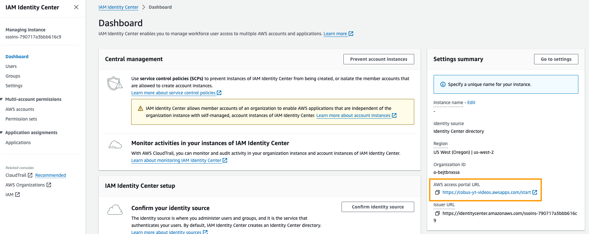
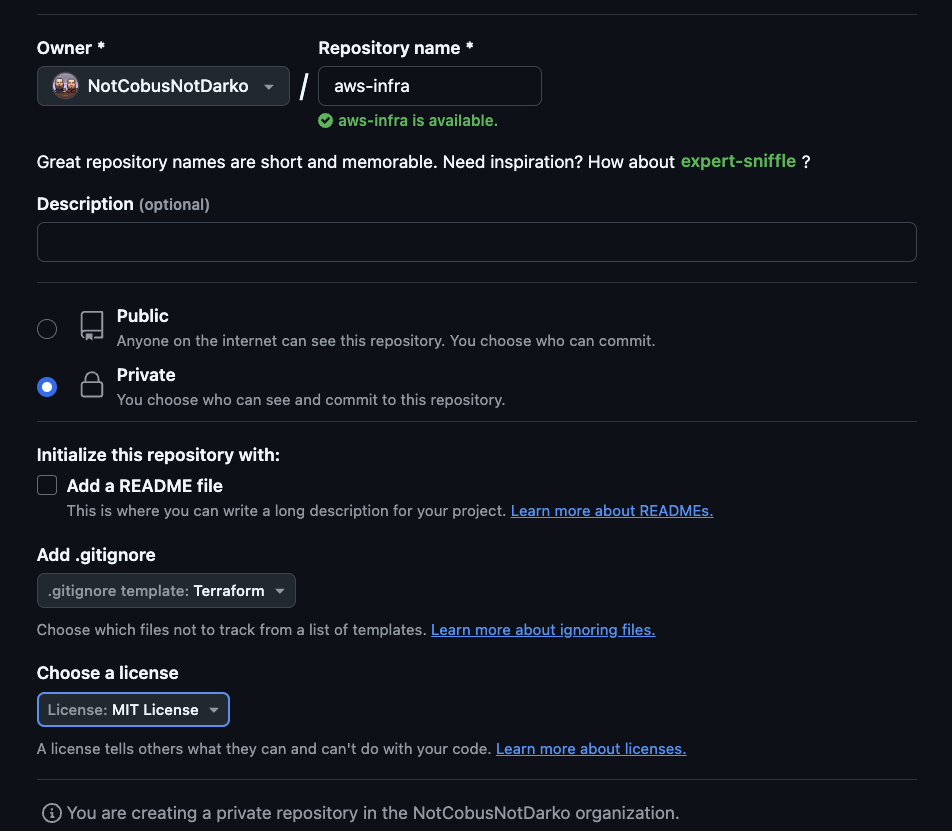
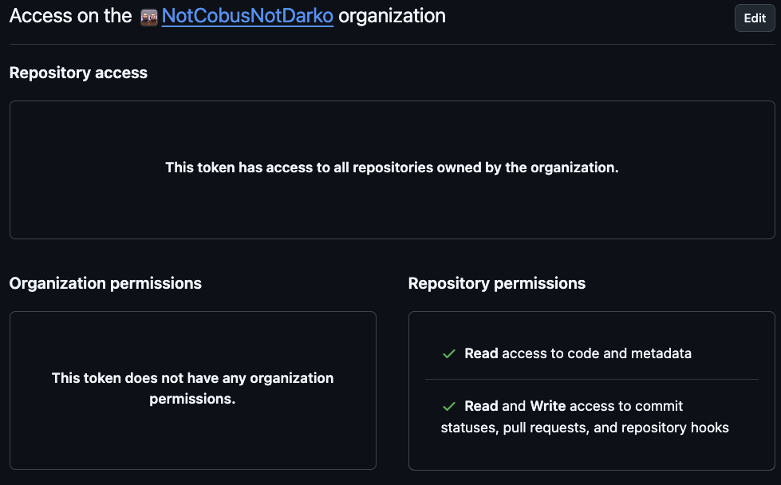
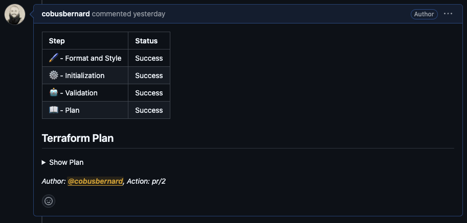

## Bootstrapping a new AWS account

Steps to follow along the YouTube video on setting up a new AWS account with - do not action any of the steps below, the order is important covered further down under [steps to follow](#steps-to-follow):

1. [Setting the MFA on your root account](https://us-east-1.console.aws.amazon.com/iam/home#/security_credentials)
2. [Enabling AWS Cost Explorer](https://us-east-1.console.aws.amazon.com/costmanagement/home#/cost-explorer)
3. [Enabling IAM Identity Center](https://us-east-1.console.aws.amazon.com/singlesignon/home?region=us-east-1#!/instances/dashboard), which will enable [AWS Organizations](https://us-east-1.console.aws.amazon.com/organizations/v2/home?region=us-west-2) as well. Set the AWS access portal URL to a friendly name.

4. [Enabling Cost Optimization Hub](https://us-east-1.console.aws.amazon.com/costmanagement/home#/cost-optimization-hub/)
5. Setting up the AWS infrastructure to store the Terraform state file in an S3 bucket (with versioning and encryption), and a DynamoDB table to use for state file locking
6. A CI/CD pipeline with CodeBuild to run `terraform plan` on any pull request in one build project, and `terraform apply` in another build project. Each one will have its own IAM Role, with the `plan` one limited to Read-Only access, and the `apply` one with full Admin-Access.
7. Set up AWS CloudTrail across all regions and accounts in the Organization.
8. A Budget with a billing alert that will trigger when 75% of USD 10 / month is reached to send an email to the email specified.
9. Setting up the `Administrators` and `Developers` groups in Identity Center, with the `policy/AdministratorAccess` and `policy/job-function/ViewOnlyAccess` IAM Policies with access to the current AWS account, and users for Mary Major (administrator) and John Doe (developer).
10. Configure your local computer's [AWS CLI](https://aws.amazon.com/cli/) to use the single sign-on (SSO) from the user in Identity Center.

## Steps to follow

1. [Sign up for a new AWS account](https://signin.aws.amazon.com/signup?request_type=register)
2. Set up your [MFA for the root user](https://us-east-1.console.aws.amazon.com/iam/home#/security_credentials)
3. Enable Cost Explorer by opening [this link](https://us-east-1.console.aws.amazon.com/costmanagement/home#/cost-explorer)
4. Enable [IAM Identity Center](https://us-east-1.console.aws.amazon.com/singlesignon/home?region=us-east-1#!/instances/dashboard) - **Important:** Make sure to select the AWS region you will be using for your infrastructure as you can only have 1 enabled per account. Choose the default option to create it for your AWS Organization - this will future-proof you if you want to use more than 1 AWS account (future content coming soon). Once enabled, set a custom start URL on the right-hand side under "AWS access portal URL" - see the image below.
  
5. Create a new private GitHub repository - suggested to make it private, select `Terraform` for the `.gitignore` file, and set an appropriate license. Adding a `README.md` is optional, but recommended.
  
6. Generate a [fine-grained personal access token (PAT) on GitHub](https://github.com/settings/tokens?type=beta) with the following permissions on the Organization (Resource owner) that the repo is in (this will be your GitHub username if you don't have a GitHub organization, or select one of the organizations from the dropdown):

    1. **Repository access:** *All repositories* - you can lock it down to just the single repo you are using to bootstrap your AWS account, but useful to allow for future pipelines for other repositories.
    2. **Repository permissions:**
        1. *Contents:* Read-only - used to read the source code for running in CodeBuild
        2. *Metadata:* Read-only - automatically set when selecting read-only for Contents
        3. *Pull requests:* Read and write - used to write a comment with the result of the build, and the `terraform plan` output for any pull request
        4. *Webhooks:* Read and write - CodeBuild will create a webhook to trigger the relevant build when code is committed / merged to the `main` branch, or a new pull request is opened
    3. **Account permissions:** None
    
7. Open up [AWS CloudShell](https://us-west-2.console.aws.amazon.com/cloudshell/home?region=us-west-2#) - make sure to select the Region at the top-right of the screen for where you want to provision your resources / where you created your Identity Center. The next set of commands will be run in CloudShell:
    1. Store your GitHub PAT in [AWS SSM Parameter Store](https://us-west-2.console.aws.amazon.com/systems-manager/parameters/?region=us-west-2) with the name `/cicd/github_tokan` as a `SecureString` using this command:

        ```bash
        aws ssm put-parameter \
            --name "/cicd/github_token" \
            --value "your GitHub PAT" \
            --type "SecureString" \
            --overwrite
        ```

    2. Install v1.9.7 of Terraform:

        ```bash
        cd /tmp/ && \
        wget https://releases.hashicorp.com/terraform/1.9.7/terraform_1.9.7_linux_amd64.zip && \
        unzip terraform_1.9.7_linux_amd64.zip && \
        sudo mv terraform /usr/bin && \
        rm LICENSE.txt terraform_1.9.7_linux_amd64.zip && \
        cd -
        ```

    3. Generate an ssh key to pull the private repo from GitHub with `ssh-keygen -t ed25519`, and then add the `.pub` part of the key to your [SSH keys](https://github.com/settings/keys) on GitHub. If you used the default key name, you can use `cat ~/.ssh/id_ed25519.pub` to get the string - make sure to copy the whole line.
    4. Set git's name and email with your details (we'll be committing some code from CloudShell later) using:

        ```bash
        git config --global user.name "Your Name"
        git config --global user.email "Your email"
        ```

    5. Clone your infrastructure repo with `git clone git@github.com/<org|github uername>/<repo name>`.
    6. Change into the code folder with `cd <my-infrastructure-repo>`, and create the `terraform` directory with `mkdir terraform`, then change into it with `cd terraform`.

8. We're now ready to start using Terraform to build our infrastructure, but first, we need to create the resources to store our state file.
    1. Create a file with a `.tf` extension, we'll be using `bootstrap.tf`, and add the following to it:
        1. **`state_file_aws_region`** - Change to your region, this is where the state file bucket will be
        2. **`state_file_bucket_name`** - Change to the name you want to use for the state file bucket - S3 bucket names are globally unique. If you want to make sure the name is available, you can open up the S3 section in the AWS console, and create the bucket, then delete it again - just make sure it is in the region you are using in this file, otherwise you will need to wait 45-60 minutes for the name to become available again.
        3. **`aws_region`** - Region to use for creating the rest of our infrastructure. (**Update 2024-10-28:** The `aws_region` input variable is not needed, if you are following along with the video, please remove it. It won't break anything as it isn't being used at all.)

            ```terraform
            module "bootstrap" {
                source = "github.com/build-on-aws/terraform-samples//modules/bootstrap-aws-account"

                state_file_aws_region  = "us-west-2"
                state_file_bucket_name = "name-for-the-state-file-bucket"
            }
            ```

        4. Run `terraform init` to install the providers needed, and download the module.
        5. Run `terraform apply` - this will create the state file resources, and generate `terraform.tf` and `providers.tf`:
            1. **`terraform.tf`** - contains the backend configuration to use S3 / DynamoDB to store the state file
            2. **`providers.tf`** - specifies the version of Terraform to use, along with the version so the `aws` and `local` provider.
        6. Run `terraform apply` again - it should now ask if you want to migrate the existing state file, type in `yes` and press enter.
        7. Congrats! The first step to set up the CI/CD pipeline for Terraform, one more step to go! But first, let's ensure we don't lose our setup by committing it:

            ```bash
            git add .
            git commit -m "Set up Terraform state file infrastructure"
            git push
            ```

9. Next, we will create the CodeBuild jobs for `terraform plan` and `terraform apply`.
    1. Add to the `bootstrap.tf` file, or create `bootstrap-cicd.tf`, and add the following - **important:** if you changed the name of the module in the previous step from `bootstrap` to something else, please update the `aws_region` and `state_file_iam_policy_arn` accordingly:
        1. **`github_organization`** - either your GitHub username, or the GitHub organization name
        2. **`github_repository`** - name of the repo
        3. **`aws_region`** - region for the AWS resources
        4. **`state_file_iam_policy_arn`** - generated policy to allow access to state file resources, used for the IAM Roles for the CodeBuild projects

        ```terraform
        module "bootstrap_cicd_aws_codebuild" {
            source = "github.com/build-on-aws/terraform-samples//modules/bootstrap-cicd-aws-codebuild"

            github_organization       = "your org | github username"
            github_repository         = "your repo name"
            aws_region                = "us-east-2"
            state_file_iam_policy_arn = module.bootstrap.state_file_iam_policy_arn

            codebuild_terraform_version = "1.9.7"
        }
        ```

    2. Run `terraform init` to download the new module.
    3. Run `terraform apply` to create the CodeBuild projects.
    4. Wohoo! Congrats! Your CI/CD pipeline is now ready, let's commit the changes to avoid losing them:

        ```bash
        git add .
        git commit -m "Adding the CI/CD pipeline"
        git push
        ```

10. Now we can use our new pipeline to set up our Identity Center users, groups, permissions, and account access. But first, let's use our new CI/CD pipeline:
    1. Create a new branch by running `git checkout -b add-identity-center` in the root of the rpo.
    2. Create a new file called `identity-center.tf` with the following, and update the `sso_users`, `sso_groups`, `permission_sets`, and `account_assignments` to your needs:

        ```terraform
        #--------------------#
        # Retrieve account id 
        #--------------------#
        data "aws_caller_identity" "current" {}

        locals {
            # Group definitions
            sso_groups = {
                Admin = {
                group_name        = "Admin"
                group_description = "Admin IAM Identity Center Group"
                },
                Developers = {
                group_name        = "Developers"
                group_description = "Dev IAM Identity Center Group"
                }
            }

            # User definitions
            sso_users = {
                marymajor = {
                group_membership = [local.sso_groups.Admin.group_name, local.sso_groups.Developers.group_name]
                user_name        = "marymajor"
                given_name       = "Mary"
                family_name      = "Major"
                email            = "marymajor@example.com"
                },
                johndoe = {
                group_membership = [local.sso_groups.Developers.group_name]
                user_name        = "johndoe"
                given_name       = "John"
                family_name      = "Doe"
                email            = "johndoe@example.com"
                }
            }

            # Permission sets definitions
            permission_sets = {
                AdministratorAccess = {
                description          = "Provides AWS full access permissions."
                session_duration     = "PT4H"
                aws_managed_policies = ["arn:aws:iam::aws:policy/AdministratorAccess"]
                tags                 = { ManagedBy = "Terraform" }
                },
                ViewOnlyAccess = {
                description          = "Provides AWS view only permissions."
                session_duration     = "PT3H"
                aws_managed_policies = ["arn:aws:iam::aws:policy/job-function/ViewOnlyAccess"]
                tags                 = { ManagedBy = "Terraform" }
                }
            }

            # Account assignments
            account_assignments = {
                Admin = {
                principal_name  = local.sso_groups.Admin.group_name
                principal_type  = "GROUP"
                principal_idp   = "INTERNAL"
                permission_sets = ["AdministratorAccess", "ViewOnlyAccess"]
                account_ids     = [data.aws_caller_identity.current.account_id]
                },
                Developers = {
                principal_name  = local.sso_groups.Developers.group_name
                principal_type  = "GROUP"
                principal_idp   = "INTERNAL"
                permission_sets = ["ViewOnlyAccess"]
                account_ids     = [data.aws_caller_identity.current.account_id]
                }
            }
        }

        module "aws-iam-identity-center" {
            source = "aws-ia/iam-identity-center/aws"

            # Use local variables for groups, users, permission sets, and account assignments
            sso_groups          = local.sso_groups
            sso_users           = local.sso_users
            permission_sets     = local.permission_sets
            account_assignments = local.account_assignments
        }
        ```

    3. Run `terraform init` and then `terraform plan` to confirm there aren't any syntax issues.
    4. Now commit and push this change with:

        ```bash
        git add .
        git commit -m "Adding Identity Center"
        git push --set-upstream origin add-identity-center
        ```

    5. Go to repository on [GitHub](https://github.com), it should have a message about the new branch, and ask if you want to create a pull request - do that. If you don't see the message, you can go to "branches", select the `add-identity-center` one, and from there create a PR.
    6. Once the PR has been created, you should see the CodeBuild job start with a yellow status indicator. Once it has completed without errors and printed out output of the build as a comment on the PR, you can merge the PR. Here's what the message should look like:
      
    7. Nice! You now have users that can log into the AWS account using SSO and the AWS access portal URL you set earlier - please note that each user would need to follow the Forgot Password flow to set it for the first time.

11. Next, we will set up an AWS CloudTrail to allow tracking all user and API activity in our account.
    1. In CloudShell, switch to the `main` branch, `git pull` the latest changes (we just merged a PR, so our local `main` won't be up to date with that merge), then create a new branch for CloudTrail. You can use the following commands to do this:

        ```bash
        git checkout main
        git pull
        git checkout -b add-cloudtrail
        ```

    2. Create a new file in the `terraform/` folder called `cloudtrail.tf` with the following contents:

        ```terraform
        module "bootstrap_cloudtrail" {
            source = "github.com/build-on-aws/terraform-samples//modules/bootstrap-cloudtrail"

            aws_region             = "us-west-2"
            cloudtrail_bucket_name = "name for your S3 bucket to store the trails"
            cloudtrail_name        = "friendly name for the trail"
        }
        ```

    3. Run `terraform init` to download the new module used.
    4. Confirm there aren't any syntax / other errors by running `terraform plan`.
    5. If there are no errors, commit the change, and push the branch with:

        ```bash
        git add .
        git commit -m "Adding CloudTrail"
        git push --set-upstream origin add-cloudtrail
        ```

    6. Go to your repo on [GitHub](https://github.com), and create a new PR from this branch.
    7. Wait for the CodeBuild job to finish, then confirm there weren't any errors by looking a the message that is posted to the PR.
    8. If there aren't any errors, merge the branch.
12. Almost done, in the home stretch now! We want to add one more resource: a Budget with a Billing Alert to notify us in case we approach a monthly spend we want to monitor.
    1. In CloudShell, switch to the `main` branch, `git pull` the latest changes (we just merged a PR, so our local `main` won't be up to date with that merge), then create a new branch for the Budget. You can use the following commands to do this:

        ```bash
        git checkout main
        git pull
        git checkout -b add-budget-billing-alert
        ```

    2. Create a new file in the `terraform/` folder called `budget.tf` with the following contents - you can set the commented out values if you want different ones from the defaults (the currently set values):

        ```terraform
        module "budget_billing_alert" {
            source = "github.com/build-on-aws/terraform-samples//modules/aws-billing-budget-notification"

            budget_email_address = "your-email-address@example.com"

            # budget_alert_amount               = 10
            # budget_alert_currency             = "USD"
            # budget_alert_threshold_percentage = 75
        }
        ```

    3. Run `terraform init` to download the new module used.
    4. Confirm there aren't any syntax / other errors by running `terraform plan`.
    5. If there are no errors, commit the change, and push the branch with:

        ```bash
        git add .
        git commit -m "Adding a Budget and Billing Alert"
        git push --set-upstream origin add-budget-billing-alert
        ```

    6. Go to your repo on [GitHub](https://github.com), and create a new PR from this branch.
    7. Wait for the CodeBuild job to finish, then confirm there weren't any errors by looking a the message that is posted to the PR.
    8. If there aren't any errors, merge the branch.
13. Congratulations! You've just set up a Terraform CI/CD pipeline to review PRs for infrastructure changes that will apply them when the PR is merged, Identity Center groups and users, CloudTrail to monitor activity on your account, and a Budget and Billing Alert to notify you when you reach 75% of the USD 10 budget.
14. The last step is to configure the users' AWS CLI using the AWS access portal URL. 
    1. On their computer, they can run the following after installing the AWS CLI:

        ```bash
        aws configure sso
        ```

    2. Enter an appropriate name for the session - this can be used to identify the user's activities from this specific computer, useful if they use multiple ones to differentiate.
    3. Use the AWS access portal URL from Identity Center.
    4. Select the default region, and output format on your preferences.
    5. After completing the configuration, they can now log in with `aws sso login` - this will open up the browser to first log into the AWS account using the user we set up for them. Remember to use "Forgot password" if they have not yet logged in after we created the user.
15. And finally, in the AWS Console, you can click on the "Actions" dropdown in CloudShell, and select `Delete` to remove all data that was used for the setup. Remember to also remove the SSH key you added to your GitHub account as it was only used in CloudShell for the bootstrapping process.

## License

This library is licensed under the MIT-0 License. See the LICENSE file.
